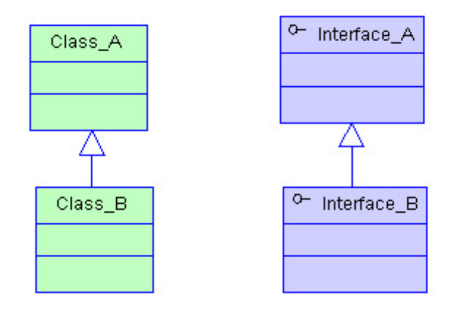

# 继承

## 一、继承初识

在 TypeScript 里，我们可以使用常用的面向对象模式。 基于类的程序设计中一种最基本的模式是允许使用继承来扩展现有的类。

继承（Inheritance）是⼀种联结类与类的层次模型。指的是⼀个类（称为⼦类、⼦接⼝）继承另外的⼀个类（称为⽗类、⽗接⼝）的功能，并可以增加它⾃⼰的新功能的能⼒，继承是类与类或者接⼝与接⼝之间最常⻅的关系。继承是一种is-a关系:




在 TypeScript 中，可以使用**extentds**关键字实现继承.

```typescript
// 定义基类
class Animal{
  name: string;
	run(distance: number) {
		return `Animal 能跑${distance}米远`
	}
}

// 定义子类
class Dog extends Animal{
	eat(something:string ) {
		return `Dog 能吃${something}`
	}
}
const dog = new Dog()
console.log(dog.run(30))
console.log(dog.eat('骨头'))
```

在这例子中我们能看出Dog继承了Animal的方法.所以在dog对象中能调用基类的run()方法.

## 二、super

上面我们使用extends实现了基本的继承,但是当我们要继承父类的构造方法或者重写父类的方法来扩展子类的功能时,我们必须使用**super.**

```typescript
class Animal{
	// 定义属性
	name: string;
	// 构造函数
	constructor(n: string) {
		this.name = n
	}
	run(distance: number) {
		console.log(`${this.name} 跑 ${distance}m`)
	}
}

class Dog extends Animal{
	name:string='藏獒'
	constructor(name: string) {
		// 调用基类的构造方法, super()必须在构造函数中第一个实现,否则报错.
		super(name)
    // 输出
    console.log(`${this.name}`)
	}
	// 重写父类的方法
	run(distance: number = 5) {
		super.run(distance)
    console.log(`子类dog的run方法: ${this.name} 跑了 ${distance}`)
	}

	eat(something:string ) {
		return `Dog 能吃${something}`
	}
}
const dog = new Dog('京巴')
dog.run()

const dog1:Animal = new Dog('中华田园犬')
dog1.run(34)
```

子类通过super()调用父类的方法,会执行基类的构造方法, 执行完后才会继续执行自己的构造方法., 如果子类中定义自己的属性, 会

## 三、子类使用父类的属性和方法

**若子类定义自己的属性, 默认使用子类的属性, 若不定义自己的属性, 使用基类的属性.**

```typescript
class Animal{
	// 定义属性
	name: string;
	// 构造函数
	constructor(n: string) {
		this.name = n
	}
	run(distance: number) {
		console.log(`${this.name} 跑 ${distance}m`)
	}
}

class Dog extends Animal{
	name: string="king"
	constructor(name: string) {
		// 调用基类的构造方法
		super(name)
		console.log(`${name}`)
		// this.name = name
		console.log(`${this.name}`)
	}
	// 重写父类的方法
	run(distance: number = 5) {
		super.run(distance)
		console.log(`子类dog的run方法: ${this.name} 跑了 ${distance}`)
	}

	eat(something:string ) {
		return `Dog 能吃${something}`
	}
}

class QiuDog extends Dog{

	// 默认使用子类的属性.若注释掉就使用父类的属性值
	name: string = '秋田犬'
	
	constructor(n: string) {
		// 调用基类构造方法
		super(n)
		// 给属性赋值,会使用传递的二狗子
		// this.name = n
	}
	cry() {
		console.log(`${this.name} 能旺旺叫`)
	}
}

const qiudog = new QiuDog('二狗子')
qiudog.cry()
console.log(qiudog.name)
```


