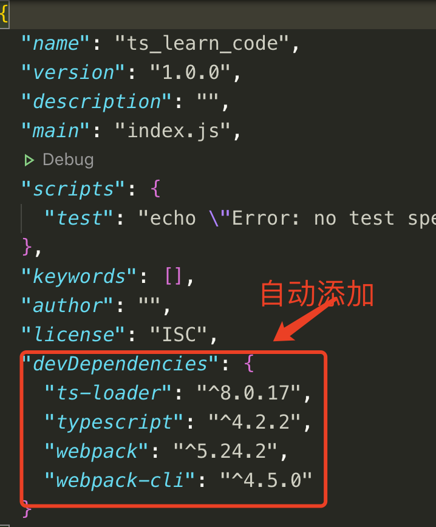
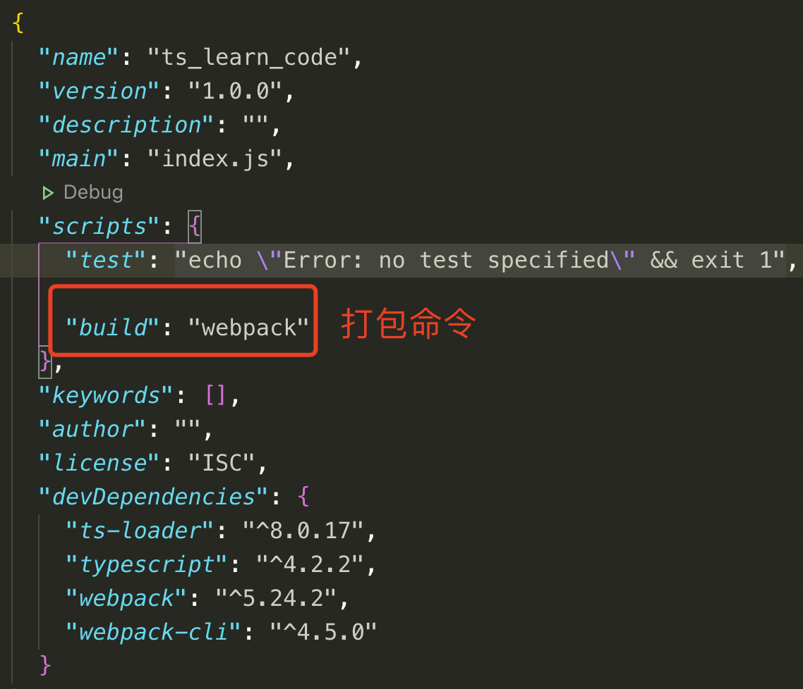
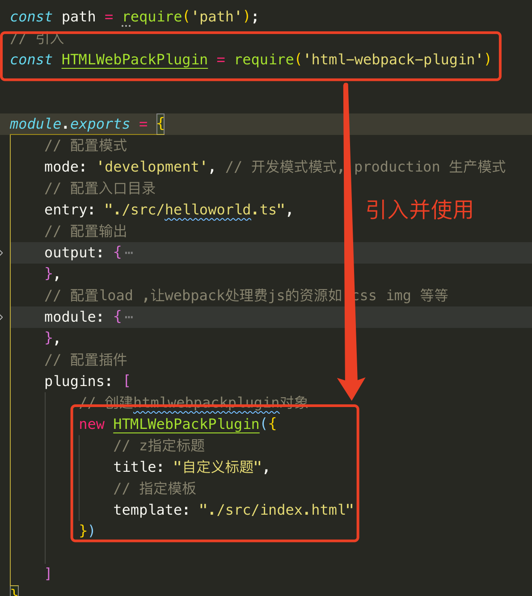
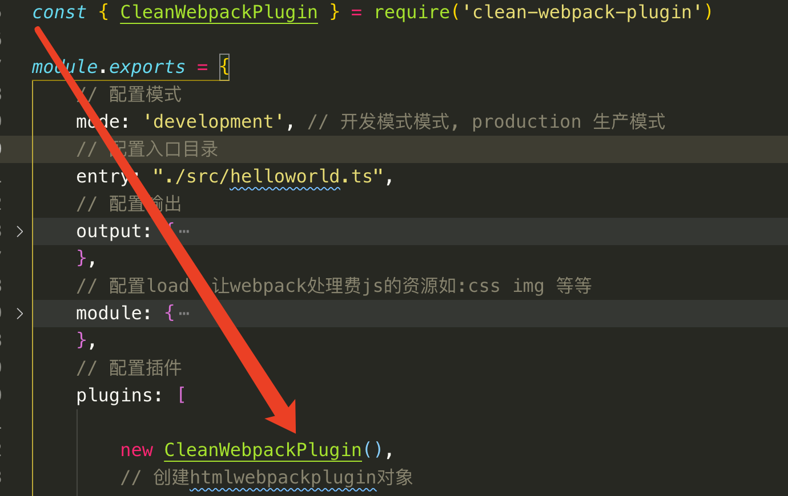

# Webpack打包ts文件

## 一、初步打包项目

在终端下执行命令: **npm init -y**创建package.json管理项目.然后安装webpack 集成ts的依赖:

```shell
npm install -D webpack webpack-cli typescript ts-loader
```

安装完成后会在package.json的开发依赖下自动添加进去刚才安装的依赖.



然后再项目根目录下创建webpack.config.js文件,对webpack进行配置

```json
const path = require('path');


module.exports = {
    // 配置模式
    mode: 'development', // 开发模式模式, production 生产模式
    // 配置入口目录
	entry: "./src/helloworld.ts",
    // 配置输出
    output: {
        // 配置多出口文件生成
        filename: '[name].js', // 输出的js
        path: path.resolve(__dirname, 'dist') // 需要导入node的path模块,最终生成的目录在dist
    },
    // 配置load ,让webpack处理费js的资源如:css img 等等
    module: {
        // 指定加载规则
		rules: [
			{
				test: /\.ts$/,
				use: 'ts-loader',
				exclude: /node_modules/
			}
		]
    },
  	// 配置要引用的模块
  	resolve:{
      extensions:['.ts', '.tsx', 'js']
    }
    // 配置插件
    plugins: []
}
```

然后在package.json中添加打包命令,然后就可以在终端下执行: **npm run build** 进行打包,会在dist目录下生成打包后的文件.



##  二、使用WebPack相关插件打包项目

### 1. Html-webpack-plugin

 Html-webpack-plugin能够让我们使用模板创建页面,避免重复的手工创建.

终端下执行命令进行安装:

```shell
npm install -D html-webpack-plugin
```

安装后在webpack.config.js 中进行引用, 并在src 目录下创建模板index.html



### 2. Webpack-dev-server和clean-webpack-plugin

Webpack-dev-server能检测网页是否有改动, 改动就自动刷新; clean-webpack-plugin是自动清除打包后的旧文件,保证打包后的文件时最新的

在终端下执行命令安装页面热加载服务器, 

```shell
npm i -D webpack-dev-server clean-webpack-plugin
```

安装完毕后在package.json 文件下添加启动服务的命令, 然后在终端下执行: **npm start** 自动打开打包后的网页

```shell
# MAC
"start": "webpack serve --open 'google chrome'"
# Window
"start": "webpack serve --open chrome.exe"
```

修改webpack.config.js 文件,引入并使用clean-webpack-plugin.




### 3. 使用babel 解决兼容

在终端下执行下面命令进行安装相关依赖:

```shell
npm install -D @babel/core @babel/preset-env babel-loader core-js
```

安装后修改webpack.config.js,修改后如下:

```json
const path = require('path');
// 引入
const HTMLWebPackPlugin = require('html-webpack-plugin')

const { CleanWebpackPlugin } = require('clean-webpack-plugin')

module.exports = {
    // 配置模式
    mode: 'development', // 开发模式模式, production 生产模式
    // 配置入口目录
	entry: "./src/helloworld.ts",
    // 配置输出
    output: {
        // 配置多出口文件生成
        filename: '[name].js', // 输出的js
		path: path.resolve(__dirname, 'dist'), // 需要导入node的path模块,最终生成的目录在dist
		// 告诉webpack 不适用箭头函数
		environment:{
			arrowFunction: false
		}
		
    },
    // 配置load ,让webpack处理费js的资源如:css img 等等
    module: {
        // 指定加载规则
		rules: [
			{
				test: /\.ts$/,
				use: [
					// 配置babel,按需配置
					{
						// 配置加载器
						loader: "babel-loader",
						// 配置babel
						options: {
							// 设置预定义环境
							presets: [
								[
									// 指定环境插件
									"@babel/preset-env",
									// 配置信息
									{
										// 配置项目要兼容的浏览器版本
										targets: {
											"chrome": "88",
											'is':"11"
										},
										// 版本要和下载的大版本一致
										"corejs": "3",
										// 使用corejs的方式是: 按需加载
										"useBuiltIns": "usage"
									}
								]
							]
						}
					},
					'ts-loader'
				],
				exclude: /node_modules/
			}
		]
	},
	resolve: {
		extensions:['.ts', '.tsx', '.js']
	},
    // 配置插件
	plugins: [

		new CleanWebpackPlugin(),
		// 创建htmlwebpackplugin对象
		new HTMLWebPackPlugin({
			// z指定标题
			title: "自定义标题",
			// 指定模板
			template: "./src/index.html"
		})
      
    ]
}
```

自此我们的前期准备全部完成.