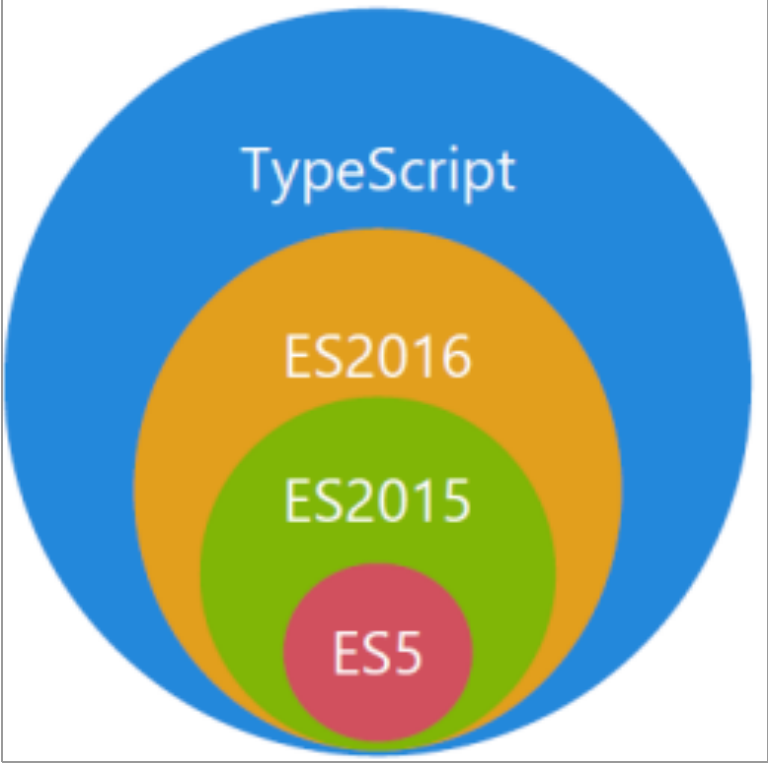
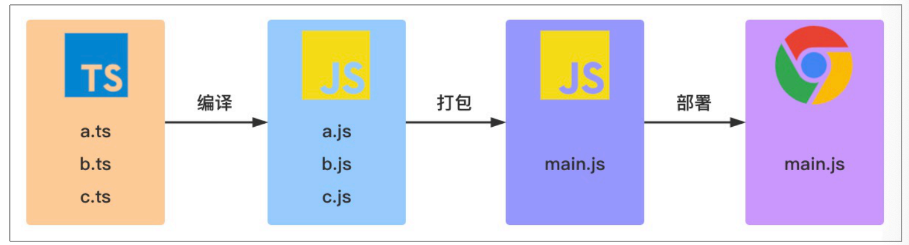
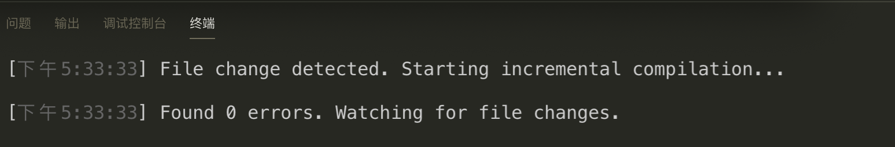
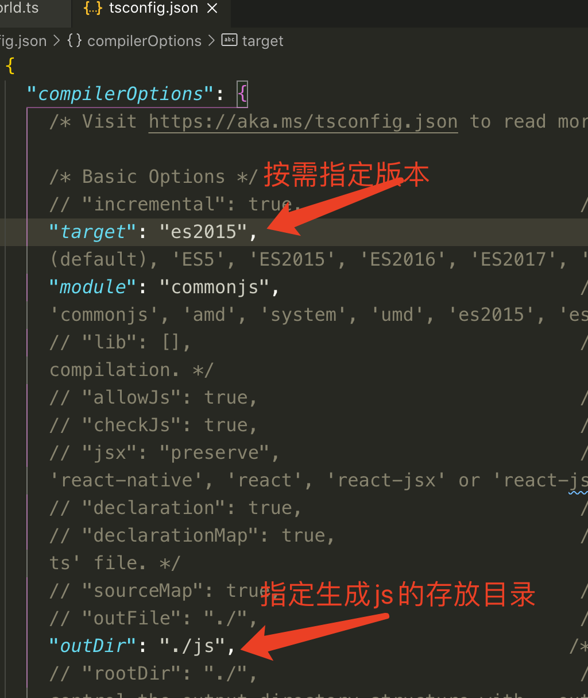

# Typescript快速入门

## 一、Typescript 是什么

TypeScript 是由微软开发的一款开源的编程语言,是 JavaScript 的⼀个超集，本质上是向这个语⾔添加了可选的静态类型和基于类的⾯向对象编程,因Typescript更像后端Java/C# 这样的面向对象的语言可以让JS开发大型企业项目.

TypeScript 提供最新的和不断发展的 JavaScript 特性，包括那些⾃ 2015 年开始的 ECMAScript 和未来的提案中的特性，⽐如异步功能和 Decorators，以帮助建⽴健壮的组件。下图显示了 TypeScript 与ES5、ES2015 和 ES2016 之间的关系：




谷歌也在大力支持 Typescript 的推广，谷歌的 angular2.x+就是基于 Typescript 语法;最新的 Vue 、React 也可以集成 TypeScript;Nodejs 框架 Nestjs、midway 中用的就是 TypeScript 语法。

为了直观显示TypeScript和JavaScript的区别,请看下表:

|                   TypeScript                   |                 JavaScript                 |
| :--------------------------------------------: | :----------------------------------------: |
|     TypeScript用于解决大型项目的代码复杂性     |       ⼀种脚本语⾔，⽤于创建动态⽹⻚       |
|           强类型，⽀持静态和动态类型           |          弱类型,没有静态类型选项           |
| 最终被编译成 JavaScript 代码，使浏览器可以理解 |           可以直接在浏览器中使⽤           |
|              ⽀持模块、泛型和接⼝              |           不⽀持模块、泛型和接⼝           |
|       社区的⽀持仍在增⻓，⽽且还不是很⼤       | ⼤量的社区⽀持以及⼤量⽂档和解决问题的支持 |


## 二、TypeScript的安装

1. 在终端使用下面命令安装:

```shell
npm install -g typescript 
#或者
cnpm install -g typescript 
#或者
yarn global add typescript
```

> 1. 必须先安装nodejs
>
> 2. 如果电脑上面没有安装过 cnpm，请先安装 cnpm: 
>
> ```shell 
> npm install -g cnpm --registry=https://registry.npm.taobao.org
> ```
>
> 3. 如果电脑上面没有安装过 yarn 请先安装 yarn:
>
> ```shell
> npm install -g yarn 
> #或者
> cnpm install -g yarn
> ```

2. 验证TypeScript

   ```shell
   tsc -v
   # Version 4.2.2
   ```

3. 编译TypeScript文件

   ```shell
   tsc hellworld.ts
   # helloworld.ts => helloworld.js会把ts文件编译成js文件
   ```

4. 典型的TypeScript的工作流程

   

如你所⻅，在上图中包含 3 个 ts ⽂件：a.ts、b.ts 和 c.ts。这些⽂件将被 TypeScript 编译器，根据配置的编译选项编译成 3 个 js ⽂件，即 a.js、b.js 和 c.js。对于⼤多数使⽤ TypeScript 开发的 Web 项⽬，我们还会对编译⽣成的 js ⽂件进⾏打包处理，然后在进⾏部署。

## 三、TypeScript初体验

一下仅仅做演示.新建一个helloworld.ts文件并输入一下内容

```shell
function greet(person: string) {
	return 'Hello, ' + person; 
}

console.log(greet("TypeScript"));
```

然后执行tsc helloworld.ts命令, 之后会生成一个编译后的helloworld.js文件.

```javascript
function greet(person) {
	return 'Hello, ' + person; 
}

console.log(greet("TypeScript"));
```

观察以上编译后的输出结果，我们发现 person 参数的类型信息在编译后被擦除了。TypeScript 只会在编译阶段对类型进⾏静态检查，如果发现有错误，编译时就会报错。⽽在运⾏时，编译⽣成的 JS 与普通的 JavaScript ⽂件⼀样，并不会进⾏类型检查。

## 四、自动编译ts文件

### 方法一:

直接在终端执行命令: **tsc -w** 进行监控, 监控tsc 是否改变,改变后直接进行编译,生成对应的js 文件.



> tsc -w 命令中w 是watch 监听监视的意思. 监听文件是否修改. 
>
> tsc helloworld.ts -w 监听指定文件.

### 方法二:

在vscode工具的终端下执行:**tsc --init** 自动生成tsconfig.json文件,然后修改配置文件,如下



然后在vscode 点击: 终端->运行任务->typescript-> tsc:监视-tsconfig.json 然后就可以自动生成代码了. 关于tsconfig.json的内容在下一章节进行详解.